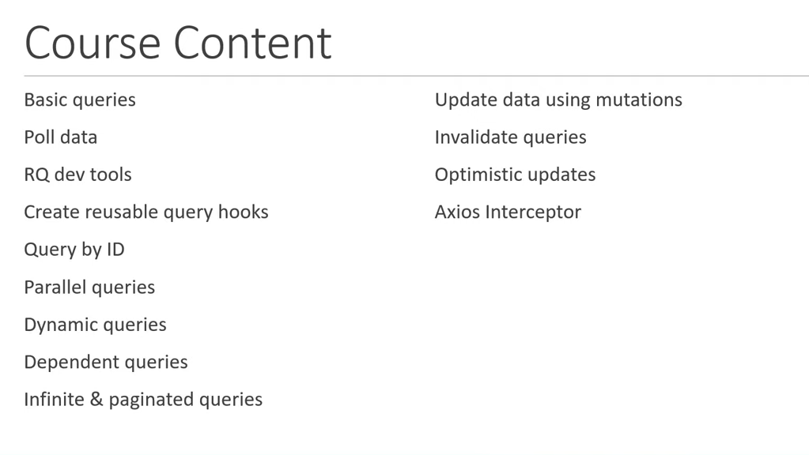

REFER PROJECT FOLDER `react-query-demo`

#### 1. Intro to React-Query




#### 2. Query Cache

Every query is cached for 5 minutes & react-query relies on that

```js
// isLoading is not set to true if the cache contains the data & that data is then used.
// But the network request is sent in the background & if the request is successful the data is updated
const { isLoading, data, isError, error, isFetching } = useQuery(
  "super-heroes",
  fetchSuperHeroes
);

console.log(isLoading, isFetching);
```


**`isLoading` is set to `true` only during the _initial fetch request_. `isFetching` is set to `true` during the _initial fetch request_ as well as the _background fetch request_**

```js
const { isLoading, data, isError, error, isFetching } = useQuery(
  "super-heroes",
  fetchSuperHeroes,
  {
    cacheTime: 5000,
  }
);
```

When we move to other page like **`Home Page`** then the above query doesn't have any observers & then it bcms **`inactive`**. After becoming inactive for more than 5000 ms the cache containing this data is cleared ☝️

#### 3. Using cached data **without refetching in the background**

This can be done using `staleTime` property in the configuration

**NOTE :- It is not necessary for the `cacheTime` to be greater than the `staleTime` but it is ideal to keep the `cacheTime` greater than the `staleTime`**

```js
const { isLoading, data, isError, error, isFetching } = useQuery(
  "super-heroes",
  fetchSuperHeroes,
  {
    cacheTime: 5 * 60000, // 5 minutes
    staleTime: 30000,
  }
);
```

**NOTE :- `staleTime` is 0 by default so the request immediately bcms stale**

`isLoading` & `isFetching` are both false

**The query will remain `fresh` for 30 seconds & no background fetching will be done in that time**

#### 4. `refetchOnMount` and `refetchOnWindowFocus`

**`refetchOnMount` refetches when the request is in `stale` state. If the `staleTime` is `0` then the request immediately bcms `stale`**

```js
const { isLoading, data, isError, error, isFetching } = useQuery(
  "super-heroes",
  fetchSuperHeroes,
  {
    refetchOnMount: "always",
    // true :- fetchOnMount then refetchOnMount if the request IS STALE
    // false :- fetchOnMount then don't refetchOnMount (no network requests will be made)
    // "always" :- refetchOnMount will always fetch on mount EVEN IF THE REQUEST IS NOT STALE
  }
);
```

**`refetchOnWindowFocus` default value is `true`**

**`refetchOnWindowFocus` refetches when we focus on that window or tab**

```js
const { isLoading, data, isError, error, isFetching } = useQuery(
  "super-heroes",
  fetchSuperHeroes,
  {
    refetchOnWindowFocus: true,
    // true, false, "always" :- will refetchOnWindowFocus irrespective of wether the data is stale or not
  }
);
```

**`refetchOnWindowFocus` default value is `true`**

#### 5. `refetchInterval` for Polling

```js
const { isLoading, data, isError, error, isFetching } = useQuery(
  "super-heroes",
  fetchSuperHeroes,
  {
    refetchInterval: 2000,
    // false :- default Value
    // time in milli seconds
    // IT WILL STOP AUTOMATICALLY WHEN WE NO LONGER FOCUS ON THAT WINDOW
  }
);
```

```js
const { isLoading, data, isError, error, isFetching } = useQuery(
  "super-heroes",
  fetchSuperHeroes,
  {
    refetchInterval: 2000,
    refetchIntervalInBackground: true,
  }
  // IT KEEP ON FETCHING WHEN WE NO LONGER FOCUS ON THAT WINDOW
);
```

#### 5. fetchData using on user events using `useQuery`

**For that use `refetch` function provided by useQuery hook**

```js
const { isLoading, data, isError, error, isFetching, refetch } = useQuery(
  "super-heroes",
  fetchSuperHeroes,
  {
    // false :- disable automatic refetching when the query mounts or changes query keys so we can trigger it on events
    enabled: false,
  }
);

return (
  <>
    <h2>React Query Super Heroes Page</h2>
    <button onClick={refetch}>Fetch heroes</button>
    {data?.data.map((hero) => (
      <div key={hero.name}>{hero.name}</div>
    ))}
  </>
);
```

#### 6. Success & Error Callbacks to the useQuery hook

```js
// React injects data in the callbacks
const onSuccess = (data) => {
  console.log("Perform side effect after data fetching", data);
};

// React injects data in the callbacks
const onError = (error) => {
  console.log("Perform side effect on error", error);
};

const { isLoading, data, isError, error, isFetching, refetch } = useQuery(
  "super-heroes",
  fetchSuperHeroes,
  {
    // false :- disable automatic refetching when the query mounts or changes query keys
    enabled: false,
    onSuccess: onSuccess,
    onError: onError, // the query retries 3 times before calling onError callback
  }
);
```

#### 7. Data Transformation

```js
// Now the `data` will contain the tranformed data
const { isLoading, data, isError, error, isFetching } = useQuery(
  "super-heroes",
  fetchSuperHeroes,
  {
    select: (data) => {
      const superHeroNames = data.data.map((hero) => hero.name);
      return superHeroNames;
    },
  }
);

return (
  <>
    <h2>React Query Super Heroes Page</h2>

    {data && data.map((name) => <div key={name}>{name}</div>)}
  </>
);
```

#### 8. Query By Id

```js
const fetchSuperHero = (heroId) => {
  return axios.get(`http://localhost:4000/superheroes/${heroId}`);
};

const fetchSuperHeroAnotherWay = (params) => {
  console.log(params);
  const heroId = params.queryKey[1];
  return axios.get(`http://localhost:4000/superheroes/${heroId}`);
};

export const useSuperHeroData = (heroId) => {
  // Way 1
  // return useQuery(["super-hero", heroId], () => fetchSuperHero(heroId));

  // Way 2 :- useQuery automatically passes many things to the FETCHER FUNCTIONS
  return useQuery(["super-hero", heroId], fetchSuperHeroAnotherWay);
};
```

An array is passed here `["super-hero", heroId]` so that it will know that the queries are seperate for different ids & it will cache them & do things with them accordingly

#### 9. Parallel Queries

```js
// THESE QUERIES ARE RUN IN PARALLEL
const { data: superHeroes } = useQuery("super-heroes", fetchSuperHeroes);
const { data: friends } = useQuery("friends", fetchFriends);
```

#### 10. Dynamic Parallel Queries

**When we don't know how many queries we need to run & the no. of queries might vary from render to render we use `Dynamic Parallel Queries`**

**We cannot invoke the queries manually using `useQuery` N number of times bcz they will keep on changing & it will violate the RULES OF HOOKS**

```js
const fetchSuperHero = (heroId) => {
  return axios.get(`http://localhost:4000/superheroes/${heroId}`);
};

export const DynamicParallelPage = ({ heroIds }) => {
  const queryResults = useQueries(
    heroIds.map((id) => {
      return {
        queryKey: ["super-hero", id],
        queryFn: () => fetchSuperHero(id),
      };
    })
  );

  // In the devtools we can see 2 queries being made

  return <div>Dynamic Parallel Page</div>;
};
```

#### 11. Dependent Queries

```js
const fetchUserByEmail = (email) => {
  return axios.get(`http://localhost:4000/users/${email}`);
};

const fetchChannelById = (channelId) => {
  return axios.get(`http://localhost:4000/channels/${channelId}`);
};

export const DependentQueriesPage = ({ email }) => {
  const { data: user } = useQuery(["user", email], () =>
    fetchUserByEmail(email)
  );

  // channelId will be undefined first
  const channelId = user?.data.channelId;

  const { data: channel } = useQuery(
    ["channel", channelId],
    () => fetchChannelById(channelId),
    {
      enabled: !!channelId, // !! converts the value to boolean
      // will be true only after the channelId is present
    }
  );

  return <div>Dependent Queries</div>;
};
```


That query for channel data is not made to the backend when the component mounts bcz it is `disabled` as `channelId` is `undefined`

#### 12. Initial Query Data

For `RQSuperHero` page we can use the data from `RQSuperHeroes` list page as the **INITIAL DATA** & a background refetch request will be made & the data will be updated. Therefore the **isLoading** won't be set to `true`

**This is also helpful is displaying the partial data then displaying the full data after refetch in the background is successful**

```js
import { useQuery, useQueryClient } from "react-query";

// Data is already present for the 'super-heroes' query

export const useSuperHeroData = (heroId) => {
  const queryClient = useQueryClient();

  return useQuery(["super-hero", heroId], () => fetchSuperHero(heroId), {
    initialData: () => {
      // get data of the query with 'super-heroes' key
      const hero = queryClient
        .getQueryData("super-heroes")
        ?.data?.find((hero) => hero.id === parseInt(heroId));

      if (hero) {
        // this format is important bcz this is how we are consuming data in the component
        return {
          data: hero,
        };
      } else {
        return undefined;
      }
    },
  });
};
```

#### 13. Paginated Queries

```js
import { useState } from "react";
import { useQuery } from "react-query";
import axios from "axios";

const fetchColors = (pageNumber) => {
  return axios.get(`http://localhost:4000/colors?_limit=2&_page=${pageNumber}`);
  // json server supports pagination out of the box
  // _limit=someno&_page=someno
  // _limit is the size of the chunk, _page is the nth chunk
};

export const PaginatedQueriesPage = () => {
  const [pageNumber, setPageNumber] = useState(1);
  const { isLoading, isError, error, data, isFetching } = useQuery(
    ["colors", pageNumber],
    () => fetchColors(pageNumber),
    {
      // NORMALLY data is kept for the queries but is for specified time only like 5 minutes by default
      // keeps the previous data forever for those queries
      keepPreviousData: true,
    }
  );

  if (isLoading) {
    return <h2>Loading...</h2>;
  }

  if (isError) {
    return <h2>{error.message}</h2>;
  }

  return (
    <>
      <div>
        {data?.data.map((color) => {
          return (
            <div key={color.id}>
              <h2>
                {color.id}. {color.label}
              </h2>
            </div>
          );
        })}
      </div>
      <div>
        <button
          onClick={() => setPageNumber((page) => page - 1)}
          disabled={pageNumber === 1}
        >
          Prev page
        </button>
        <button
          onClick={() => setPageNumber((page) => page + 1)}
          disabled={pageNumber === 4}
        >
          Next page
        </button>
      </div>
      {isFetching && "Loading...."}
    </>
  );
};
```

#### 14. Infinite Queries :- Adding data to the existing data like `infinite scrolling`

Instead of `useQuery` hook use `useInfiniteQuery` hook

`useInfiniteQuery` injects some values in the fetcher function

In infinite query the query remains the same 'colors'

```js
import { Fragment, useState } from "react";
import { useInfiniteQuery } from "react-query";
import axios from "axios";

// useInfiniteQueries inserts some parameters in the fetcher function
const fetchColors = ({ pageParam = 1 }) => {
  return axios.get(`http://localhost:4000/colors?_limit=2&_page=${pageParam}`);
};

export const InfiniteQueriesPage = () => {
  const {
    isLoading,
    isError,
    error,
    data,
    hasNextPage,
    fetchNextPage,
    isFetching,
    isFetchingNextPage,
  } = useInfiniteQuery(["colors"], fetchColors, {
    // using this "getNextPageParam" to change the pageParam bcz "pageParam" is managed by react-query
    getNextPageParam: (lastPage, pages) => {
      if (pages.length < 4) {
        return pages.length + 1;
      } else {
        return undefined;
      }
    },
    // "getNextPageParam" sets the "hasNextPage"'s value to true or false. This boolean is helpful in enabling & disabling the button
  });

  if (isLoading) {
    return <h2>Loading...</h2>;
  }

  if (isError) {
    return <h2>{error.message}</h2>;
  }

  return (
    <>
      <div>
        {/* useInfiniteQuery returns "pages" object instead of "data" object */}
        {/* this "pages" list goes on increasing as more & more pages are loaded */}
        {/* each "page" contains "limit" number of items */}
        {data?.pages.map((page, i) => {
          // This above "group" is not visible in the REACT QUERY DATA EXPLORER
          // "group" groups together data from multiple "pages"
          return (
            <Fragment key={i}>
              {JSON.stringify(page)}
              {page.data.map((color) => (
                <h2 key={color.id}>
                  {color.id}-{color.label}
                </h2>
              ))}
            </Fragment>
          );
        })}
      </div>
      <div>
        <button disabled={!hasNextPage} onClick={fetchNextPage}>
          Load More
        </button>
      </div>
      <div>{isFetching && !isFetchingNextPage ? "Fetching" : null}</div>
    </>
  );
};
```

#### 15. Mutations are used for `CREATE`, `UPDATE` and `DELETING` data

`useMutation` Hook doesn't necessarily need the key

```js
// useSuperHeroes hook
import { useQuery, useMutation } from "react-query";
import axios from "axios";

// MUTATION FUNCTION :- for CREATING, UPDATING, DELETING data
const addSuperHero = (hero) => {
  return axios.post("http://localhost:4000/superheroes", hero);
};

export const useAddSuperHeroData = () => {
  return useMutation(addSuperHero);
};
```

```js
return (
  <div>
    <input type="text" value={name} onChange={(e) => setName(e.target.value)} />
    <input
      type="text"
      value={alterEgo}
      onChange={(e) => setAlterEgo(e.target.value)}
    />
    <button onClick={handleAddHeroClick}>Add Hero</button>
  </div>
);

const [name, setName] = useState("");
const [alterEgo, setAlterEgo] = useState("");

const {
  mutate: addHeroMutate,
  isLoading: isMutationLoading,
  isError: isMutationError,
  error: mutationError,
} = useAddSuperHeroData();

const handleAddHeroClick = () => {
  const hero = { name, alterEgo };
  addHeroMutate(hero);
};
```

#### 16. Query Invalidation

When we add the superhero to the db.json we need to refetch the heroes manually using the button.

It would be better to refetch the data again automatically

This can be done using Query Invalidation

```js
import { useQuery, useMutation, useQueryClient } from "react-query";
import axios from "axios";

// FETCHER FUNCTION
const fetchSuperHeroes = () => {
  // return the promise
  return axios.get("http://localhost:4000/superheroes");
};

// MUTATION FUNCTION :- for CREATING, UPDATING, DELETING data
const addSuperHero = (hero) => {
  return axios.post("http://localhost:4000/superheroes", hero);
};

export const useSuperHeroesData = (onSuccess, onError) => {
  // return the data returned by useQuery hook
  return useQuery("super-heroes", fetchSuperHeroes, {
    onSuccess,
    onError,
    enabled: true,
  });
};

export const useAddSuperHeroData = () => {
  const queryClient = useQueryClient();
  return useMutation(addSuperHero, {
    // onSuccess Callback
    onSuccess: () => {
      // the query-key of the query which we want to invalidate
      // this will trigger a refetch for that query
      queryClient.invalidateQueries("super-heroes");
    },
  });
};
```

**When the mutation succeeded a Background Refetch was triggered & new data is obtained**

#### 17. Handling Mutation Response

Saving an additional network request of refetching the whole list again as the post request returns the saved data & we can use to update our data

```js
export const useAddSuperHeroData = () => {
  const queryClient = useQueryClient();
  return useMutation(addSuperHero, {
    // onSuccess Callback
    onSuccess: (data) => {
      // the query-key of the query which we want to invalidate
      // this will trigger a refetch for that query
      // queryClient.invalidateQueries("super-heroes");

      // which part of query-cache to update
      queryClient.setQueryData("super-heroes", (oldQueryData) => {
        // "oldQueryData" is the already present data in the cache with query-key "super-heroes"
        return {
          ...oldQueryData,
          data: [...oldQueryData.data, data.data],
          // oldQueryData can be seen in the devtools
        };
      });
    },
  });
};
```

#### 18. Optimistic Updates

Updating the state before performing the mutation under the assumption that nothing will go wrong

**This is done to show that your app is blazing fast**

**When dealing with this we need to consider that state when the msg error outs**

```js
import { useQuery, useMutation, useQueryClient } from "react-query";
import axios from "axios";

// FETCHER FUNCTION
const fetchSuperHeroes = () => {
  // return the promise
  return axios.get("http://localhost:4000/superheroes");
};

// MUTATION FUNCTION :- for CREATING, UPDATING, DELETING data
const addSuperHero = (hero) => {
  return axios.post("http://localhost:4000/superheroes", hero);
};

export const useSuperHeroesData = (onSuccess, onError) => {
  // return the data returned by useQuery hook
  return useQuery("super-heroes", fetchSuperHeroes, {
    onSuccess,
    onError,
    enabled: true,
    // select: (data) => {
    //   const superHeroNames = data.data.map((hero) => hero.name);
    //   return superHeroNames;
    // },
  });
};

export const useAddSuperHeroData = () => {
  const queryClient = useQueryClient();
  return useMutation(addSuperHero, {
    // ===OPTIMISTIC UPDATE===
    // "onMutate" fired before the "MUTATION FUNCTION" is called & the same data as the MUTATION FUNCTION is also passed to the "onMutate" function
    onMutate: async (newHero) => {
      // cancel any BACKGROUND REFETCHES
      await queryClient.cancelQueries("super-heroes");
      const previousHeroData = queryClient.getQueryData("super-heroes");
      queryClient.setQueryData("super-heroes", (oldQueryData) => {
        // "oldQueryData" is the already present data in the cache with query-key "super-heroes"
        return {
          ...oldQueryData,
          data: [
            ...oldQueryData.data,
            { id: oldQueryData?.data?.length + 1, ...newHero }, // adding the "id" field
          ],
          // oldQueryData can be seen in the devtools
        };
      });

      // this will be used to rollback the data incase the mutation throws an error
      return {
        previousHeroData,
      };
    },
    onError: (_error, _newHero, context) => {
      // newHero is the one passed to the mutation but we don't need that now, so adding an underscore before it
      // context contains additional information related to the mutation. IT ALSO CONTAINS THE DATA RETURNED BY THE MUTATION which can be used for ROLLBACK
      queryClient.setQueryData("super-heroes", context.previousHeroData);
    },
    onSettled: () => {
      // "onSettled" is called when the mutation is successful or throws an error
      queryClient.invalidateQueries("super-heroes");
    },
  });
};
```

#### 19. Axios Interceptor

```js
// FILE :- utils/axios-utils.js

import axios from "axios";

const client = axios.create({ baseURL: "http://localhost:4000" });

// function that wraps all Axios request
export const request = ({ ...options }) => {
  client.defaults.headers.common.Authorization = `Bearer token`;

  const onSuccess = (response) => response;

  const onError = (error) => {
    // optionally catch errors & add additional logging here
    // we can perform redirects & all here
    return error;
  };

  return client(options).then(onSuccess).catch(onError);
};
```

USAGE IS AS FOLLOWS 👇

```js
import { request } from "../utils/axios-utils";

// FETCHER FUNCTION
const fetchSuperHeroes = () => {
  // return the promise
  // return axios.get("http://localhost:4000/superheroes");
  return request({ url: "/superheroes" });
};

// MUTATION FUNCTION :- for CREATING, UPDATING, DELETING data
const addSuperHero = (hero) => {
  // return axios.post("http://localhost:4000/superheroes", hero);

  return request({ url: "/superheroes", method: "post", data: hero });
};
```
